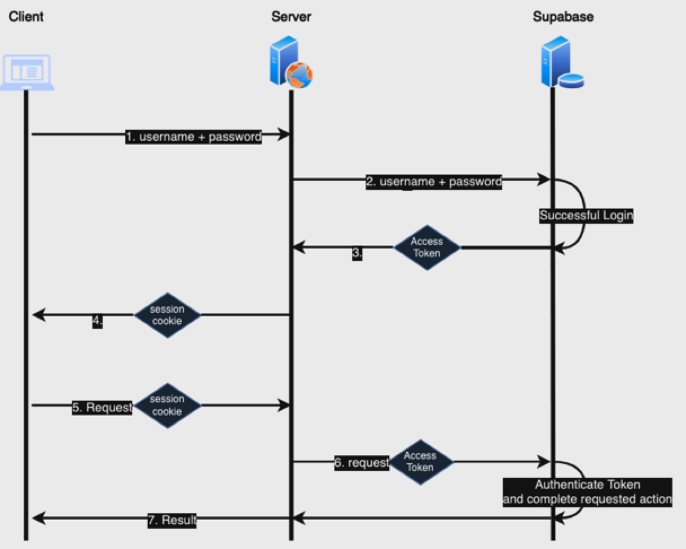
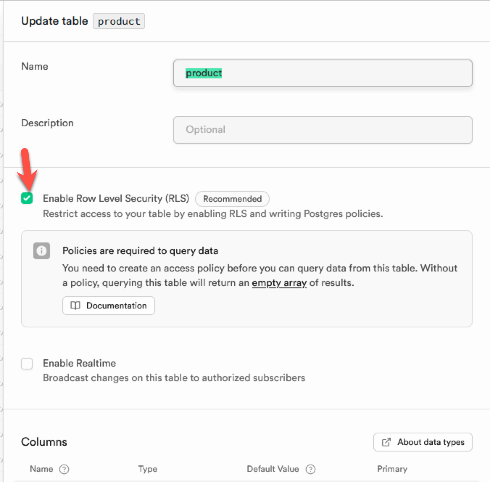
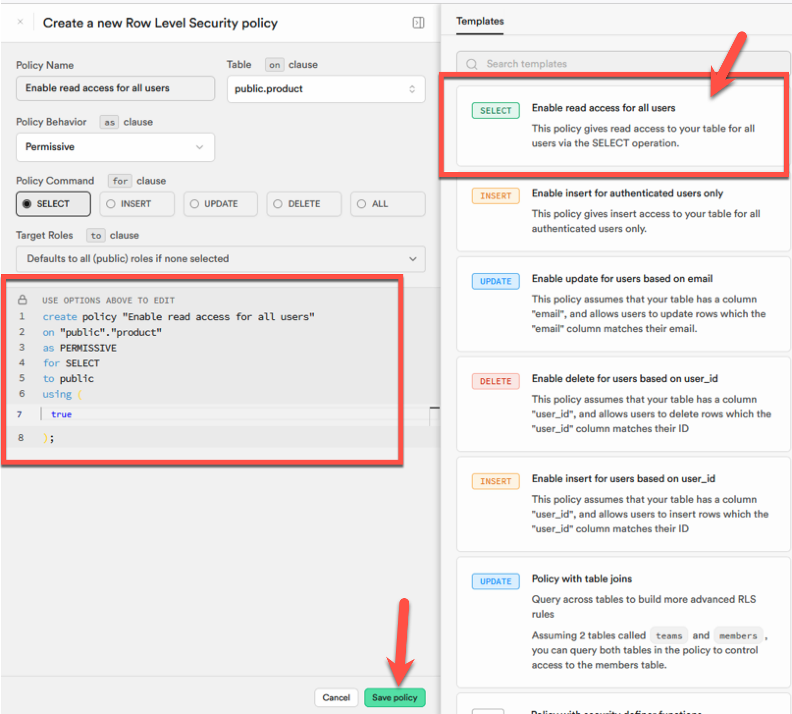
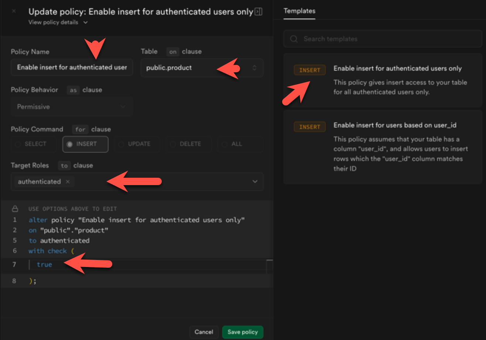
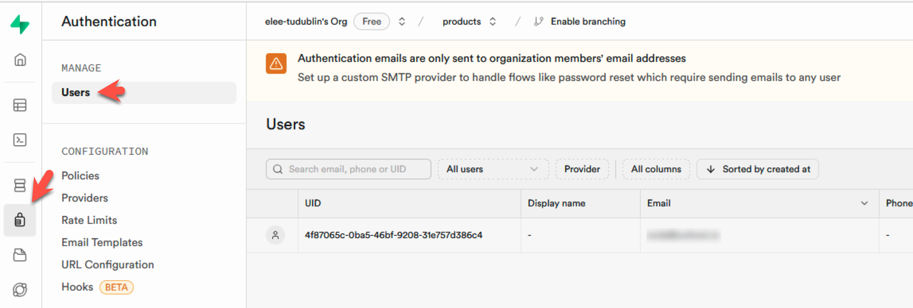
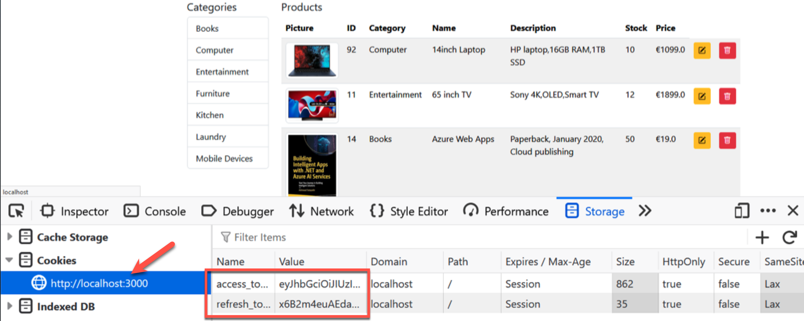

# Lab 12: Supabase User Authentication


### Getting started

**Start by cloning this repository and opening in VS Code.**

1. Configure the Python Virtual Environment

   `python -m venv venv --prompt="lab12"`

2. Activate the Virtual Environment

   `venv\Scripts\activate`

3. Install dependencies (note addition of `supabase`)

   `pip install fastapi uvicorn jinja2 python-multipart httpx supabase`

4. Setup the `.env` file, e.g. based on `.env.example` - you will need to add your Supabase URL and API Key

5. To run the application - **use port 3000 as Supabase assumes this for local redirects**

   `uvicorn app.main:app --reload --port=3000`


## Introduction

The site uses Supabase user accounts and Row Level Security to implement access control. See https://supabase.com/docs/guides/auth

The diagram below shows the data flow for a user log:

1. The user provides their `credentials` (email and password).
2. The server uses the credentials to `authenticate` the user via Supabase Auth services.
3. If successful, Supabase returns and `access token` for the user (plus other user info)
4. The server responds to the client and sets a `session cookie` containing the `access token`.
5. The Client includes the `session cookie` in subsequent requests.
6. The server uses the `access token` to authenticate the user when requesting Supabase actions.
7. Supabase responds to the server which responds to the client with the result.




## 1. Supabase Row Level Security (RLS)

1. By default Supabase allows access to the database to anyone with access to the `anon` API key. Row Level Security enables access to data to be defined using `Policies`.

   To try this out, enable RLS on the product table.

   

### 1.1 Define a policy to give read access to all users

From the Authentication menu, open `Policies`. Then `Create Policy`

Choose the **select template**. By default, this is permissive, giving public read access to the table.



Exercise: Add policies which allows Insert, update, and delete to authenticated users only. Ensure that the policies are named appropriately.

For example, the insert policy for authenticated users:




## 2. Adding New users

1. The site contains a route named **auth_routes.py** to handle user login, registration, etc.

2. The form is contained in the **view_templates** folder.

3. After the form is submitted, the form data is sent to the **auth_service** and then to the user registration function in **product_supabase.py**. This function calls the Supabase API via `supabase.auth.sign_up()`

   ```python
   # Supabase Auth for Python https://supabase.com/docs/reference/python/auth-api
   
   # register new user
   def dataUserRegister(user):
       response = supabase.auth.sign_up(user.model_dump())
       return response
   ```


Try this out. Afterwards check Supabase to see the new user account. You will also revive a confirmation email to verify the account.



For more details, check the `auth` schema in the table editor

## 3. Using session cookies and tokens

After a user account is registered or a sucessful login, Supabase returns a user object containing the user's details, role, and also **access** and **identity** tokens. The access token must be sent back to the server with any request so that the user can be authenticated and permissions check.

The User object looks like this:

```json
{
    "user": {
        "id": "4f87065c-0ba5-46bf-9208-31e757d386c4",
        "app_metadata": {
            "provider": "email",
            "providers": [
                "email"
            ]
        },
        "user_metadata": {
            "email": "user@products.ie",
            "email_verified": false,
            "phone_verified": false,
            "sub": "4f87065c-0ba5-46bf-9208-31e757d386c4"
        },
        "aud": "authenticated",
        "confirmation_sent_at": "2024-12-01T20:11:53.717333Z",
        "recovery_sent_at": null,
        "email_change_sent_at": null,
        "new_email": null,
        "new_phone": null,
        "invited_at": null,
        "action_link": null,
        "email": "user@products.ie",
        "phone": "",
        "created_at": "2024-12-01T20:11:53.684492Z",
        "confirmed_at": "2024-12-01T20:14:12.039562Z",
        "email_confirmed_at": "2024-12-01T20:14:12.039562Z",
        "phone_confirmed_at": null,
        "last_sign_in_at": "2024-12-01T21:00:26.592868Z",
        "role": "authenticated",
        "updated_at": "2024-12-01T21:00:26.595508Z",
        "identities": [
            {
                "id": "4f87065c-0ba5-46bf-9208-31e757d386c4",
                "identity_id": "0e067810-e926-4d72-9c2b-03130c18c7a8",
                "user_id": "4f87065c-0ba5-46bf-9208-31e757d386c4",
                "identity_data": {
                    "email": "user@products.ie",
                    "email_verified": false,
                    "phone_verified": false,
                    "sub": "4f87065c-0ba5-46bf-9208-31e757d386c4"
                },
                "provider": "email",
                "created_at": "2024-12-01T20:11:53.708559Z",
                "last_sign_in_at": "2024-12-01T20:11:53.707823Z",
                "updated_at": "2024-12-01T20:11:53.708559Z"
            }
        ],
        "is_anonymous": false,
        "factors": null
    },
    "session": {
        "provider_token": null,
        "provider_refresh_token": null,
        "access_token": "eyJhbGciOiJIUzI1NiIsImtpZCI6ImdUQkVuWWR6TjJHTXR1QXQiLCJ0eXAiOiJKV1QifQ.eyJpc3MiOiJodHRwczovL2FwanlqZGFkcmZ1ZWp4Y2xreHpoLnN1cGFiYXNlLmNvL2F1dGgvdjEiLCJzdWIiOiI0Zjg3MDY1Yy0wYmE1LTQ2YmYtOTIwOC0zMWU3NTdkMzg2YzQiLCJhdWQiOiJhdXRoZW50aWNhdGVkIiwiZXhwIjoxNzMzMDkwNDI2LCJpYXQiOjE3MzMwODY4MjYsImVtYWlsIjoiZW5kYUBvdXRsb29rLmllIiwicGhvbmUiOiIiLCJhcHBfbWV0YWRhdGEiOnsicHJvdmlkZXIiOiJlbWFpbCIsInByb3ZpZGVycyI6WyJlbWFpbCJdfSwidXNlcl9tZXRhZGF0YSI6eyJlbWFpbCI6ImVuZGFAb3V0bG9vay5pZSIsImVtYWlsX3ZlcmlmaWVkIjpmYWxzZSwicGhvbmVfdmVyaWZpZWQiOmZhbHNlLCJzdWIiOiI0Zjg3MDY1Yy0wYmE1LTQ2YmYtOTIwOC0zMWU3NTdkMzg2YzQifSwicm9sZSI6ImF1dGhlbnRpY2F0ZWQiLCJhYWwiOiJhYWwxIiwiYW1yIjpbeyJtZXRob2QiOiJwYXNzd29yZCIsInRpbWVzdGFtcCI6MTczMzA4NjgyNn1dLCJzZXNzaW9uX2lkIjoiYTIzNTUyMmMtMjU2Yi00MWE2LWIwN2QtYmRjYWU4YzEwMmVhIiwiaXNfYW5vbnltb3VzIjpmYWxzZX0.8EWEXBzssjaJCLWDjkVpODS7Cq3jdh8mLADX2u_1h3I",
        "refresh_token": "0s72EgXFftnWf7cHvDKvZw",
        "expires_in": 3600,
        "expires_at": 1733090426,
        "token_type": "bearer",
        "user": {
            "id": "4f87065c-0ba5-46bf-9208-31e757d386c4",
            "app_metadata": {
                "provider": "email",
                "providers": [
                    "email"
                ]
            },
            "user_metadata": {
                "email": "user@products.ie",
                "email_verified": false,
                "phone_verified": false,
                "sub": "4f87065c-0ba5-46bf-9208-31e757d386c4"
            },
            "aud": "authenticated",
            "confirmation_sent_at": "2024-12-01T20:11:53.717333Z",
            "recovery_sent_at": null,
            "email_change_sent_at": null,
            "new_email": null,
            "new_phone": null,
            "invited_at": null,
            "action_link": null,
            "email": "user@products.ie",
            "phone": "",
            "created_at": "2024-12-01T20:11:53.684492Z",
            "confirmed_at": "2024-12-01T20:14:12.039562Z",
            "email_confirmed_at": "2024-12-01T20:14:12.039562Z",
            "phone_confirmed_at": null,
            "last_sign_in_at": "2024-12-01T21:00:26.592868Z",
            "role": "authenticated",
            "updated_at": "2024-12-01T21:00:26.595508Z",
            "identities": [
                {
                    "id": "4f87065c-0ba5-46bf-9208-31e757d386c4",
                    "identity_id": "0e067810-e926-4d72-9c2b-03130c18c7a8",
                    "user_id": "4f87065c-0ba5-46bf-9208-31e757d386c4",
                    "identity_data": {
                        "email": "user@products.ie",
                        "email_verified": false,
                        "phone_verified": false,
                        "sub": "4f87065c-0ba5-46bf-9208-31e757d386c4"
                    },
                    "provider": "email",
                    "created_at": "2024-12-01T20:11:53.708559Z",
                    "last_sign_in_at": "2024-12-01T20:11:53.707823Z",
                    "updated_at": "2024-12-01T20:11:53.708559Z"
                }
            ],
            "is_anonymous": false,
            "factors": null
        }
    }
}
```

#### 3.1 Setting the cookies

The application stores the access and refresh tokens in session cookies after login so that they are available between requests. This happens in the **`@router.post("/login")`** in **auth_routes.py**:

```python
@router.post("/login")
async def postLogin(request: Request, response: Response,  userForm: Annotated[User, Form()]) :
    auth_user = userLogin(userForm)
    
    response = RedirectResponse(url="/product/", status_code=status.HTTP_302_FOUND)

    response.set_cookie(
        key = "access_token",
        # value= f"Bearer {auth_user.session.access_token}",
        value= auth_user.session.access_token,
        httponly=True,
    )
    response.set_cookie(
        key = "refresh_token",
        value= auth_user.session.refresh_token,
        httponly=True,
    )
    return response
```



#### 3.2 Reading the cookies

The cookies are used so that the Tokens are persisted between requests. When they are needed, they are read from the HTTP request. For example, they are required to insert data and so are read before calling the Supabase function to insert.

In **`@router.post("/")`** in **product_routes.py** the values are read and passed to the service with the form data:

```python
@router.post("/")
def postProduct(request: Request, productData: Annotated[Product, Form()]) :
    accessToken = request.cookies.get('access_token')
    refreshToken = request.cookies.get('refresh_token')

    # get item value from the form POST data
    new_product = newProduct(productData, accessToken, refreshToken)

    return templates.TemplateResponse("product/partials/product_tr.html", {"request": request, "product": new_product})

```


Then in **`product_supabase.py`** the tokens are used in `dataAddProduct()` to set the session before inserting:

```python
# add product, accepts product object
def dataAddProduct(product: Product, accessToken, refreshToken) :

    supabase.auth.set_session(accessToken, refreshToken)

    response = (
        supabase
        .table("product")
        .insert(product.model_dump()) # convert product object to dict - required by Supabase
        .execute()
    )

    if (response.data) :
        return dataGetProduct(response.data[0]['id'])

    return False
```


## 4. Exercices

1. Enable updating and deleting of products for authenticated users.

2. Add a logout option to the site based on code provided.

3. When a user is logged in show the logout link, otherwise show the login and register link.

**Advanced:**

1. Modify the product table to include a **user_id** column. This should be set to the id of the logged in user when a new product is added. The `dataAddProduct()` in **data_access/product_supabase.py** includes an example of how to get the id of an authenticated user. 

2. Add policies so that a user can only add, update, or delete products which they added.
